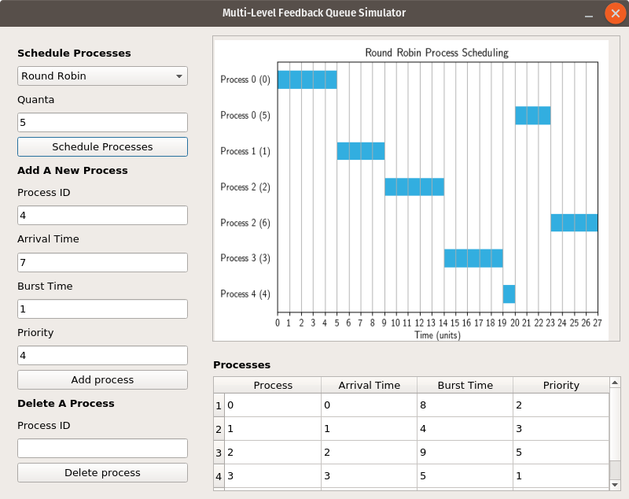

# mlfq-sim

A simulation of a Multi-Level Feedback Queue.

## Description

The project is a simulation of an operating system process scheduling algorithm called a Multi-Level Feedback Queue. It basically schedules processes for the CPU with no a priori knowledge on when the processes arrive or how long they take to execute. The algorithm "learns" which processes should be run first and which should be skipped for a while.

## Getting Started
Latest released version: v1.0.0

### Prerequisites
We use Python 3 for this project. The project uses Python 3-specific features and syntax, making it incompatible with Python 2. This means that it won't run in Python 2. Besides, we're urged to upgrade to Python 3. New projects are asked to be developed using Python 3. As a news flash (if your are not aware), by 2020, Python 2 will no longer be supported. If you have not installed Python 3 yet, please install it before running this project.

The project is written purely in Python 3. The only dependency is has is [PyQt 5](http://pyqt.sourceforge.net/Docs/PyQt5/installation.html)\* which is used for the GUI.

\* The necessary parts of the LGPL version of Qt 5 will be included when installing this package with `pip`.

For package management, we use `pip`. The project requirements are listed in `requirements.txt`. It is preferable that you create a virtual environment for this project before running it. This is to prevent poisoning your system libraries. We use `virtualenv` for that matter..

Installing Python 3, `pip`, and `virtualenv` may differ from system to system. It is not a requirement to install `virtualenv` for this project. However, to prevent library versioning issues with your other Python projects (if you have) and packages, we recommend installing `virtualenv`.

* [Installing in Windows (using Chocolatey)](http://docs.python-guide.org/en/latest/starting/install3/win/)    
  We recommend using [Chocolatey](https://chocolatey.org/) to install Python 3 in Windows. Chocolatey installs `pip` along with Python 3.

      C:\> choco install python
      C:\> python -m pip install -U pip
      C:\> pip install virtualenv

* [Installing in macOS (using Homebrew)](https://www.digitalocean.com/community/tutorials/how-to-install-python-3-and-set-up-a-local-programming-environment-on-macos)    
  To install Python 3 in macOS, make sure you have XCode, its Command Line Tools app, and Homebrew installed in your system. Homebrew installs `pip` alongside Python 3.

      $ brew install python3
      $ pip3 install virtualenv

* [Installing in Linux](http://docs.python-guide.org/en/latest/starting/install3/linux/)    
  The latest versions of Ubuntu, Debian, and their derivatives usually have Python 3 pre-installed. You just need to install `pip`. Make sure it is `python3-pip`. Otherwise, you'll be using `pip` for Python 2.7.
  
      $ sudo apt-get install python3-pip
      $ sudo pip3 install virtualenv
  
  If you are using an older version of Ubuntu or Debian, you might want to use the [deadsnakes PPA](https://launchpad.net/~deadsnakes/+archive/ubuntu/ppa) to install newer versions of Python.
      
  For other Linux distributions, please refer to your distribution's documentation. There's a good chance there's a tutorial out there teaching people how to install Python 3, `pip`, and `virtualenv` in your distribution. Just Google it. I can't list all Linux distros with Python 3 installation instructions here since there's a lot! And Microsoft even [added one more distro to the list](https://www.cnet.com/news/microsoft-introduces-azure-sphere-to-protect-your-iot-internet-of-things/)!. Can't we just use a single package manager for all Linux distros for the sake of the users? We could all use [Snap](https://snapcraft.io/).
* [Installing in FreeBSD](http://www.alvinsim.com/freebsd-install-python-3-and-pip/)    
  Use `portmaster` to install Python 3 in FreeBSD. `pip` will be installed alongside Python 3.

      $ sudo portmaster lang/python3
      $ sudo pip install virtualenv

  **DISCLAIMER: We have no collective experience with using FreeBSD.**
  
* For other platforms not mentioned, please open up your browser, Then, enter `http://lmgtfy.com/?q=how+to+install+Python+in+<your platform>`in the address bar, replacing `<your platform>` with the name of your operating system.

  In other words, please search Google for the instructions. Thanks! :)

### Setting It Up
#### Creating a virtual environment
At this point, we must create a `virtualenv` folder to store our virtual environment. If you choose not to install `virtualenv`, you may skip this section.

* [Creating a virtual environment in Windows](http://programwithus.com/learn-to-code/Pip-and-virtualenv-on-Windows/)    

      C:\> cd \path\to\environment\directory
      C:\> virtualenv venv

      # Activate the environment
      C:\> \path\to\venv\Scripts\activate

* Creating a virtual environment in UNIX-based OSes (e.g. Linux, macOS, FreeBSD)

      $ cd /path/to/environment/directory
      $ virtualenv venv -p /usr/bin/python3  
      # /usr/bin/python3 should be changed to the path of Python 3 in your system, if it differs.

      # Activate the environment
      $ source /path/to/venv/bin/activate

#### Cloning the repo
This part is easy. Make sure you have Git installed. Don't tell me you don't. The commands are the same for most systems, if you are using the command-line version of Git.

      $ cd /path/to/project/dir
      $ git clone https://github.com/seanballais/mlfq-sim.git
      $ cd mlfq-sim/

You may also use a GUI Git client, if you want to.

#### Installing the dependencies
**WARNING: If you didn't install and use `virtualenv`, you will be installing packages globally, which is [not good](https://realpython.com/python-virtual-environments-a-primer/#why-the-need-for-virtual-environments), and may lead to library versioning issues with other Python applications and packages.**

The only dependency the project has is PyQt 5. As such, you must install Qt 5 first before proceeding. Make sure that Qt 5 is installed so that we will be able to run our project. Please refer to the *[Getting Started](http://doc.qt.io/qt-5/gettingstarted.html)* guide of Qt to know how to install Qt in your system. We must also install the Python 3 binding of Qt 5.

    $ cd /path/to/project/
    $ pip install PyQt5 # or pip3

If all things went well, we should have all the packages we need to run the project.

#### Installing the project

Before we can use the project or run tests, we must install the project to your system or, preferably, virtual environment.

    $ python3 setup.py install

After performing that, we may now proceed to running the project itself or the tests.

##### Running the project

To run the project, we just type the following command.

    $ mlfq-sim

This will open the application itself.

##### Running the tests

To run the tests, we just type the following command.

    $ python3 setup.py tests

The output displayed will contain information whether or not the tests are succeeding.

And we're done! :D Please enjoy playing around with the simulator.

## Contributing
Eyyy, not allowed yet. Sorry!

## Versioning
We use [SemVer](https://semver.org/) for versioning.

## Authors
* Sean Francis N. Ballais - [Website](https://seanballais.github.io) | [Twitter](https://twitter.com/seanballais) | [CV](https://seanballais.github.io/CV.pdf)
* Warren Kenn H. Pulma - [Twitter](https://twitter.com/pulmaats)

## License
This project is licensed under the [MIT License](LICENSE.txt).

## Credits
The project uses the free version of [PyQt](https://riverbankcomputing.com/software/pyqt/intro) 5 and open source version of [Qt](https://www.qt.io/) 5 for the GUI component. They are licensed under [GPLv3](https://riverbankcomputing.com/commercial/pyqt) and [LGPLv3 (with some parts under GPLv3)](https://doc.qt.io/qt-5.10/licensing.html), respectively.

This project uses [PyQtImageViewer](https://github.com/marcel-goldschen-ohm/PyQtImageViewer) by [Marcel Goldschen Ohm](https://github.com/marcel-goldschen-ohm) to display the process schedule in the simulator. PyQtImageViewer is licensed under the [MIT](https://docs.pytest.org/en/latest/license.html) license.

The project uses [pytest](https://pytest.org) for writing and running tests. pytest is licensed under the [MIT](https://docs.pytest.org/en/latest/license.html) license.

The project also used [PyScaffold](https://pyscaffold.org/en/latest/) to auto-generate the project structure. PyScaffold is licensed under the [MIT license](https://pyscaffold.org/en/latest/license.html).

## Acknowledgements
* Thanks to Mr. Victor M. Romero II for teaching us Operating System Concepts. Now, I can't stop viewing scheduling problems in normal situations as CS problems. -Sean *(ew, pabibo)*
